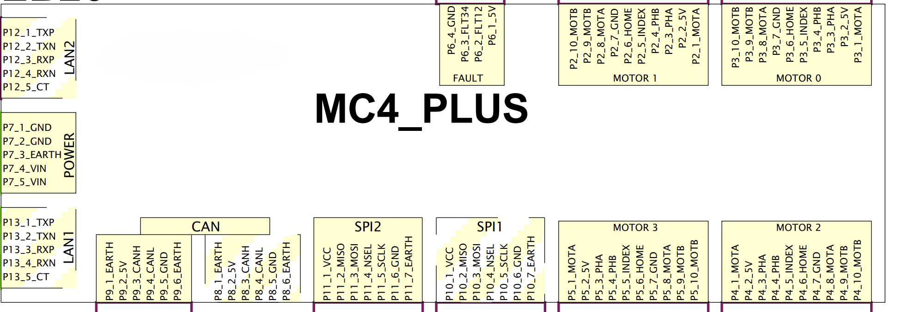
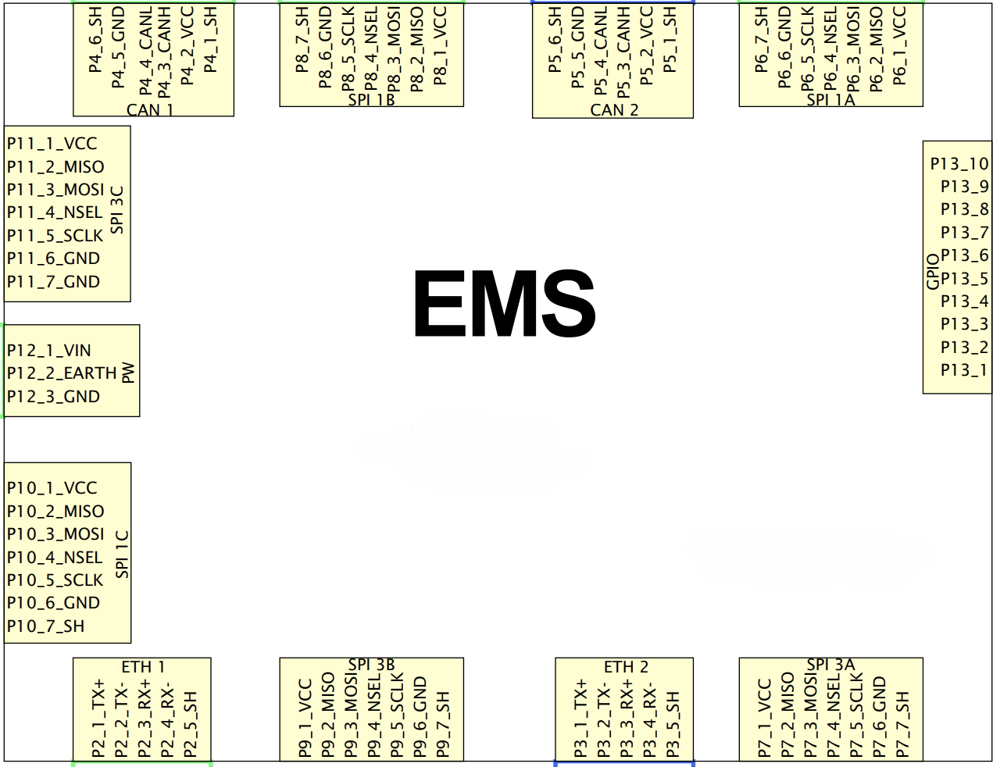
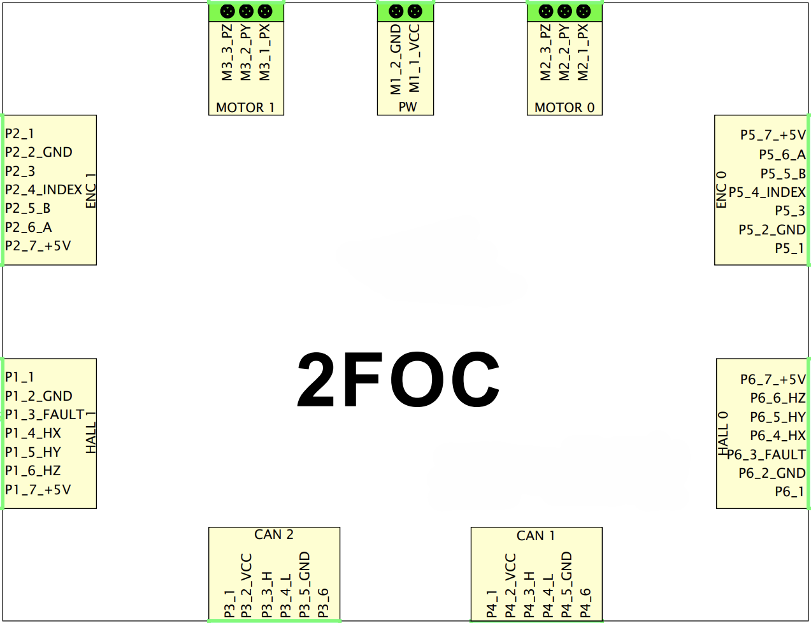

# Board Types: MC4plus, EMS4, and 2FOC

Vizzy's ETH-based motion control stack uses three distinct board types: the **MC4plus** and **EMS4** are Ethernet-connected master boards that communicate with the PC104 over the robot's LAN, while the **2FOC** is a CAN-connected motor driver that attaches to an EMS4 board to provide Field-Oriented Control (FOC) for each individual joint.

| Feature | MC4plus (EB04, EB05) | EMS4 (EB06) | 2FOC (per joint, on CAN) |
|---------|---------------------|------------|--------------------------|
| Network interface | Ethernet (ETH) | Ethernet (ETH) | CAN bus (via EMS4) |
| Axes per board | Up to 4 | Up to 4 | 1 (dedicated per motor) |
| Motor type supported | Brushed DC | Brushless DC (BLDC) | Brushless DC (BLDC) |
| Actuator interface | Direct PWM | CAN bus (to 2FOC boards) | Direct drive (FOC phase currents) |
| Primary encoder | Quadrature (on-board) | AEA (not used) | ROIE (not used) |
| Secondary encoder | None | None | None |
| Joint-level absolute position | No | No | No |
| Torque / current control | No | Yes (via 2FOC) | Yes (inner FOC current loop) |
| Field-Oriented Control | No | Delegated to 2FOC | Yes (native) |
| Suitable for | Head joints (light, low-inertia) | Arm joints (heavy, precision needed) | Individual arm motors |

## MC4plus

The MC4plus is a 4-axis Ethernet motion control board designed for light-duty joints. It directly drives brushed DC motors via PWM and reads quadrature encoders on-board. Because it has no absolute encoder interface, joints require a calibration phase at startup to find their zero reference. It is the right choice for Vizzy's head given that the eye and neck joints are low-inertia and position control alone is sufficient.

  
   <em>MC4plus board schema</em>

## EMS4

The EMS4 (Ethernet Motion Supervisor, 4 axes) is a more capable Ethernet board that acts as a CAN master. Rather than driving motors directly, it delegates low-level motor control to 2FOC boards connected on its CAN bus. Torque control is achieved through the 2FOC boards' inner current loop. It is used for Vizzy's left arm shoulder, where heavier loads and higher precision demand FOC-level current regulation. In Vizzy's current configuration, the EMS4 reads quadrature encoders at the motor through the CAN bus (not joint-level AEA absolute encoders), so the shoulder joints require the same hard-stop calibration procedure as the head boards.

  
   <em>EMS4 board schema</em>

## 2FOC

The 2FOC (2-axis Field-Oriented Control) board is a CAN-connected motor driver developed by IIT. It is not an Ethernet board and does not communicate with the PC104 directly, it receives setpoints from an EMS4 master over CAN and executes the inner FOC control loop locally at high frequency. Each 2FOC board drives two brushless DC motors and reads a ROIE (Rotor Incremental Encoder) to close the current/velocity loop. Multiple 2FOC boards are chained on the EMS4's CAN bus, up to two per joint.

  
   <em>2FOC board schema</em>

> **Minimum supply voltage:** The 2FOC board requires at least **12.5 V** to operate correctly when no load is attached. Supplying less than this may cause the board to fail to initialise or behave erratically.
